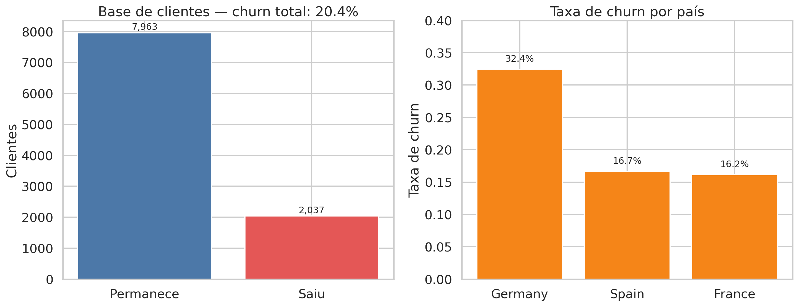
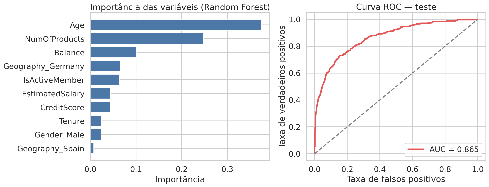

#  Predição de Churn Bancário & Estratégias de Retenção

> **Objetivo:** Construir um modelo preditivo para priorizar clientes com maior risco de cancelamento (*churn*) e transformar a saída do modelo em ações operacionais de retenção de alto impacto.

---

##  Nota sobre os Dados & Escopo
Este dataset é de corte transversal (não contém histórico temporal nem receita/margem por cliente). Portanto, a análise foca em **estratégia de priorização e capacidade operacional**, e não no cálculo de impacto financeiro líquido real. Para implementação em produção, recomenda-se a inclusão de janelas de previsão, custo por oferta e valor de vida do cliente (LTV).

---

##  Dados & Panorama Geral
- **Base de Dados:** 10.000 clientes e 14 atributos (sem valores ausentes).
- **Variável-alvo:** `Exited` (`1` = cancelou; `0` = permaneceu).
- **Taxa de Churn Observada:** **20,4%** (2.037 clientes).
- **Atributos Removidos:** `RowNumber`, `CustomerId` e `Surname` (identificadores sem poder explicativo causal).

---

##  Perguntas de Negócio & Insights



### 1. Qual é a magnitude do problema?
**20,4%** da base cancelou seus serviços (**2.037 clientes**). Isso estabelece o tamanho da oportunidade de retenção.

### 2. Quais segmentos apresentam maior risco?
- 🇩🇪 **Geografia:** Clientes na Alemanha possuem churn de **32,4%** (vs. 16,2% na França e 16,7% na Espanha).
- 💤 **Engajamento:** Clientes inativos apresentam **26,9%** de churn (vs. 14,3% entre ativos).
- 🎂 **Faixa Etária:** Clientes entre 51–60 anos atingem **56,2%** de churn (e 34,0% entre 41–50 anos).
- 📦 **Produtos:** Clientes com apenas 1 produto têm **27,7%** de churn, enquanto aqueles com 2 produtos caem para **7,6%**. *(Nota: Clientes com 3 e 4 produtos apresentam taxas atipicamente altas, mas representam amostras pequenas de 266 e 60 clientes, exigindo validação antes do rollout).*


---

##  Desempenho do Modelo Preditivo

Divisão dos dados em **80% treino / 20% teste** (estratificada, `random_state=42`). O modelo final adotado foi um **Random Forest** com peso de classe balanceado.



### Métricas no Conjunto de Teste (2.000 clientes):
- **ROC-AUC:** `0.865` — Excelente capacidade de separação entre classes.
- **PR-AUC:** `0.700` — Métrica chave devido ao desbalanceamento do churn.

### Impacto da Lista de Ação (Limiar em 50%):
- **Precision:** 54,9%
- **Recall:** 73,0%
- **F1-Score:** 62,7%

> **Comparativo:** Sem o modelo, a escolha aleatória encontraria apenas 20,4% de churners. Com o modelo (limiar 0,50), foram sinalizados 541 clientes, dos quais **297 eram realmente churners** (eficiência 2,7x superior à seleção aleatória).

---

##  Escolha do Limiar Operacional (Trade-off)

O limiar (*threshold*) deve ser escolhido para maximizar o valor esperado da operação:

$$\text{Valor}_i = p_i \times \text{taxa\_de\_sucesso} \times \text{margem\_retida} - \text{custo\_da\_oferta}$$

### Opções de Limiar no Conjunto de Teste:
| Limiar (*Threshold*) | Contatos Gerados | Churners Capturados | Precision | Recall |
| :---: | :---: | :---: | :---: | :---: |
| **0,35** | 898 | 356 / 407 | 39,6% | 87,5% |
| **0,50** | 541 | 297 / 407 | 54,9% | 73,0% |
| **0,60** | 374 | 246 / 407 | 65,8% | 60,4% |

- **Usar limiar baixo (ex: 0,35):** Quando o custo do churn é alto e a capacidade de contato da equipe é grande.
- **Usar limiar alto (ex: 0,60):** Quando o custo de oferta/contato é elevado ou a equipe operacional é restrita.

---

##  Recomendações Práticas
1. **Priorização Dinâmica:** Ordenar contatos por risco predito e valor estimado do cliente.
2. **Jornadas Personalizadas:** Criar réguas de comunicação específicas para a Alemanha, clientes inativos e faixas etárias acima de 40 anos.
3. **Investigação de Produto:** Investigar o motivo de insatisfação do grupo de 3–4 produtos (possíveis gargalos de usabilidade ou precificação).
4. **Experimento (Teste A/B):** Dividir clientes em grupo Controle (sem abordagem) e Tratamento para mensurar a retenção incremental e ROI em 90 dias.

---

##  Limitações & Próximos Passos
- **Temporalidade:** Criar *snapshots* mensais em produção para garantir precedência temporal das variáveis.
- **Ética e Viés:** Monitorar variáveis como gênero para evitar viés algorítmico em decisões automáticas.
- **Enriquecimento de Dados:** Incorporar dados de uso de canais, chamados no suporte, reclamações e NPS.

---

##  Estrutura do Repositório & Arquivos

```text
Projeto/
├── data/
│   ├── Churn_Modelling.csv         # Dataset original do Kaggle
│   ├── segmentos_churn.csv         # Dados tratados / agregados
│   └── limiares_operacionais.csv   # Tabela de limiares operacionais
├── images/
│   ├── eda_churn.png
│   ├── eda_segmentos_variaveis.png
│   └── modelo_resultados.png
├── churn_model.py                  # Script Python que treina o modelo de ML
└── README.md
